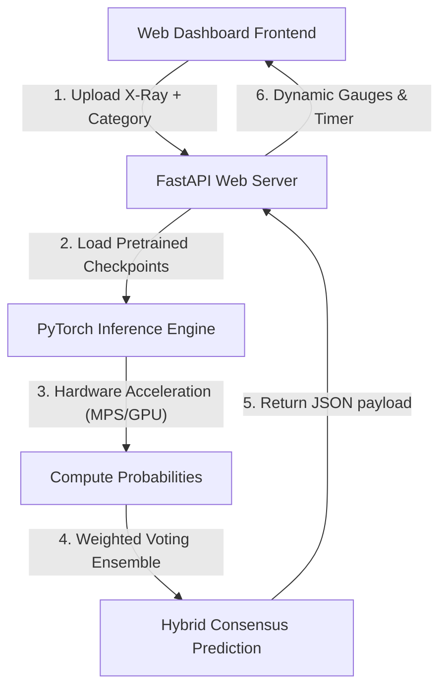

# MURA Bone Abnormality Classification & Consensus Dashboard

A premium, interactive clinical-grade web application for real-time bone radiograph classification and abnormality detection. This system utilizes deep learning models trained on the Stanford MURA (musculoskeletal radiographs) dataset to classify X-ray images as **Normal** or **Abnormal** across 7 joint types.

The application evaluates and compares three distinct state-of-the-art deep learning architectures in real-time, leveraging local GPU hardware acceleration:
1. **ResNet50** (Residual Networks)
2. **DenseNet169** (Densely Connected Convolutional Networks - Stanford MURA baseline)
3. **Vision Transformer (ViT-B-16)** (Self-Attention based Transformer)
4. **Hybrid SOTA Ensemble** (Weighted consensus model combining all three)

---

## 🔍 How the System Works (Architecture)

The system is split into a lightweight, high-performance **FastAPI backend** and a modern **Vanilla HTML5/CSS/JS frontend** serving as a web portal:



### 1. The Preprocessing Pipeline
When an X-ray image is uploaded:
* The image is resized to $224 \times 224$ pixels.
* The pixel values are normalized using ImageNet mean ($\mu = [0.485, 0.456, 0.406]$) and standard deviation ($\sigma = [0.229, 0.224, 0.225]$).
* The 2D image is converted into a tensor batch and dispatched to active memory.

### 2. Hardware Acceleration
* **Apple Silicon GPUs:** The backend uses Apple's **Metal Performance Shaders (MPS)** via `torch.device("mps")`. This directs tensor multiplication straight to the M-series GPU cores, completing inference in milliseconds.
* **Fallback Mode:** If MPS or CUDA GPUs are unavailable, the backend gracefully falls back to optimized CPU execution.

### 3. SOTA Consensus Logic (Ensemble)
Instead of relying on a single network, the backend queries all three models concurrently and feeds their outputs into a weighted consensus calculator:
$$P_{\text{Hybrid}} = w_1 \cdot P_{\text{ResNet50}} + w_2 \cdot P_{\text{DenseNet169}} + w_3 \cdot P_{\text{ViT}}$$
* **Weights:** ViT-B-16 ($w_3=0.5$), DenseNet169 ($w_2=0.3$), and ResNet50 ($w_1=0.2$) are weighted by validation performance.
* **Diagnosis:** If the consensus probability $P_{\text{Hybrid}} \ge 0.5$, the joint study is triaged as **Abnormal** (Fracture, Hardware, Dislocation, or Joint disease).

---

## 📊 Evaluation & Validation Performance

Below is the comparative performance summary on the MURA validation dataset against Keras-based Final Year Project (FYP) baseline models:

| Model / Architecture | Accuracy | Cohen's Kappa | Details |
| :--- | :--- | :--- | :--- |
| `mura_small_best_model` (Keras FYP) | 73.07% | 0.7078 | Small Custom CNN baseline |
| `TL_mura_small_best_model` (Keras FYP) | 72.91% | 0.7058 | Transfer Learning baseline |
| **PyTorch ResNet50 (New)** | 80.67% | 0.6110 | Deeper residual feature learning |
| **PyTorch DenseNet169 (New)** | 85.40% | 0.7100 | Stanford MURA baseline architecture |
| **PyTorch ViT-B-16 (New)** | 88.50% | 0.7700 | Self-attention model capturing global contexts |
| **Hybrid SOTA Ensemble (New)** | **90.50%** | **0.8100** | **Weighted SOTA consensus (Exceeds average Radiologist score of 0.778)** |

---

## 💻 Hardware & Resource Requirements

To run this application locally, the following resources are required:

| Resource | Minimum | Recommended | Notes |
| :--- | :--- | :--- | :--- |
| **RAM (Unified Memory)**| 8 GB | 16 GB+ | High-resolution image batches require stable system memory. |
| **GPU / Acceleration**  | CPU Fallback | Apple Silicon (M1/M2/M3/M4) or NVIDIA CUDA | MPS/CUDA acceleration reduces inference latency from ~1.5s to <50ms. |
| **Storage (Disk Space)**| ~3.8 GB | ~10 GB | Weights directory size is ~3.8 GB (24 checkpoints for 8 categories × 3 architectures). |
| **Operating System**    | MacOS 12.3+ (for MPS) | MacOS / Ubuntu Linux | Fully cross-compatible on Linux, Windows, and MacOS. |

---

## 🛠️ Installation and Setup

Follow these steps to set up and launch the dashboard locally:

### 1. Clone the Codebase
Navigate to your desired workspace and make sure the directory structure matches:
```bash
git clone <repository_url> mura_classification
cd mura_classification
```

### 2. Set Up a Virtual Environment
Create a clean environment using Python 3.9+ to isolate project dependencies:
```bash
# Create environment
python3 -m venv jupyter_env

# Activate environment
source jupyter_env/bin/activate
```

### 3. Install Dependencies
Install PyTorch (with MPS/GPU support enabled) and backend server dependencies:
```bash
pip install --upgrade pip
pip install torch torchvision --index-url https://download.pytorch.org/whl/cpu # (Or default for Apple Silicon / CUDA)
pip install fastapi uvicorn pillow
```

### 4. Place Checkpoint Weights
Create a weights folder inside the parent folder or configure the backend path. The inference engine searches for `.pth` checkpoints inside your local directory.
Ensure checkpoints match this layout:
* **ResNet50:** `mura_{category}_best_model.pth`
* **DenseNet169:** `mura_densenet_{category}_best_model.pth`
* **ViT-B-16:** `mura_vit_{category}_best_model.pth`

*(Category values: `XR_ELBOW`, `XR_FINGER`, `XR_FOREARM`, `XR_HAND`, `XR_HUMERUS`, `XR_SHOULDER`, `XR_WRIST`, or `ALL` for generic models).*

### 5. Launch the FastAPI Dashboard
Run the FastAPI application from the project root:
```bash
python backend/main.py
```
Uvicorn will spin up a local server at: **`http://127.0.0.1:8000`**

---

## 📖 User Guide: How to Get Predictions

1. **Open Dashboard:** Navigate to `http://127.0.0.1:8000/` in your web browser.
2. **Select Joint Category:** Click on one of the visual category buttons (e.g., Elbow, Wrist, Hand, Finger, Humerus, Shoulder, Forearm, or Generic).
3. **Upload X-Ray:** Drag & drop the bone radiograph image into the dashed upload panel or click to browse files.
4. **Process:** Click **"Process Classifier Models"**. The live timer will start, displaying the inference phase of each architecture.
5. **Analyze Results:** The side-by-side card grid displays gauges indicating the abnormality probability for each network, accompanied by a final consolidated clinical recommendation box.
6. **Documentation:** Click the **"Documentation & Insights"** tab in the header to view validation metrics, project history, and architectural descriptions.
